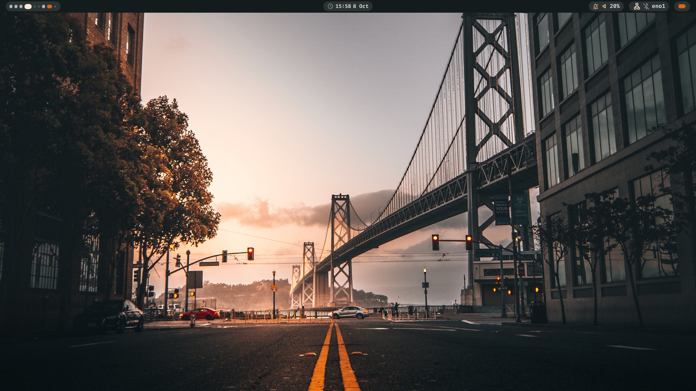
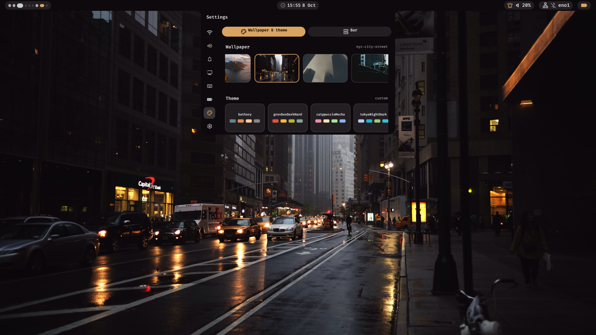
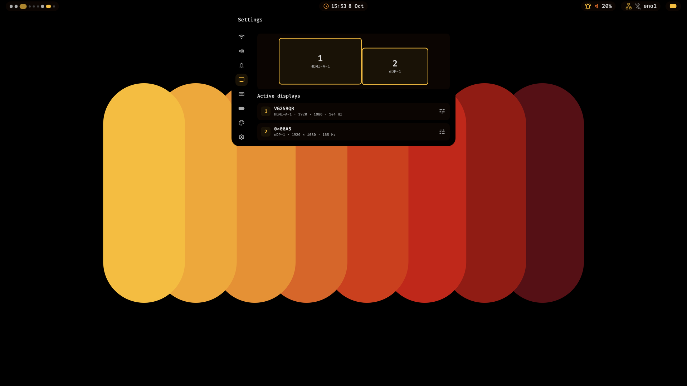
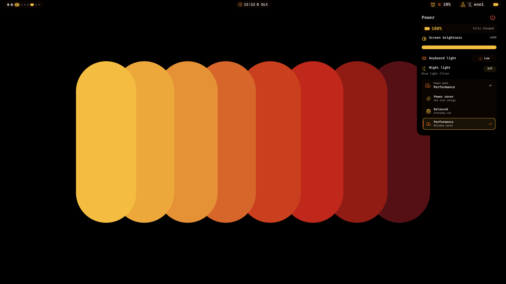
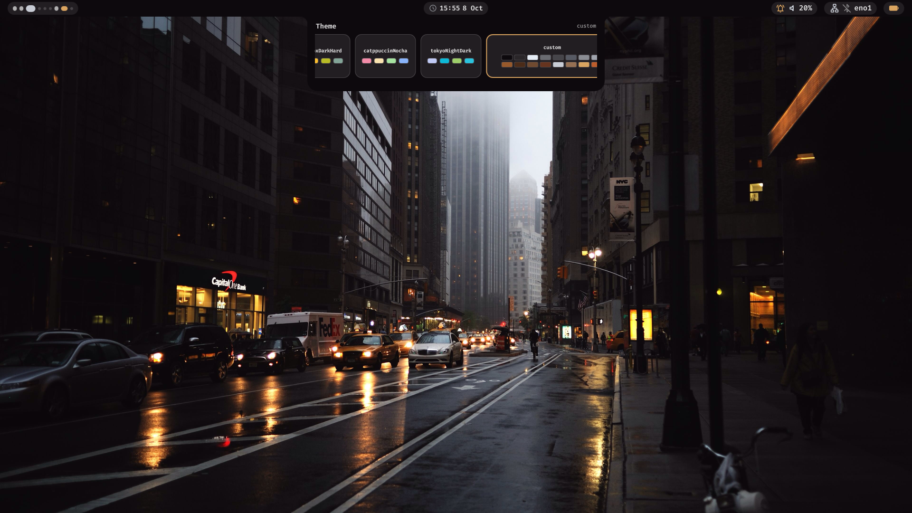
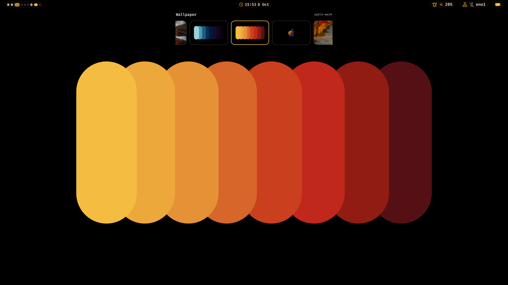

# Nix config

Nix configuration for my Fedora and Nixos machines.



## Setup at a glance

| Machine | System | Configuration |
| --- | --- | --- |
| **Legion** | Fedora + Nix | Home Manager: `legion` |
| **Bobasek** | NixOS | NixOS system + Home Manager: `bobasek` |

Clone this repo to `~/.config/nix-config`. On **Legion**, run `./scripts/install.sh` to prepare Fedora.
If Nix was just installed, log out and back in before applying Home Manager:

```sh
nix run home-manager/release-26.05 -- switch --flake ~/.config/nix-config#raffaele@legion
./scripts/setup_gpu.sh
```

The GPU script connects Nix GUI apps to Fedora's drivers after the first Home Manager switch.

On **Bobasek**, apply the system and home configuration together:

```sh
sudo nixos-rebuild switch --flake ~/.config/nix-config#bobasek
```

## The look

| Appearance settings | Display settings |
| :---: | :---: |
|  |  |
| **Power Module** | **Theme Picker** |
|  |  |

<p align="center">
  <strong>Wallpaper Picker</strong><br>
  
</p>

## Where things live

- `hosts/` — settings specific to Legion and Bobasek
- `nixos/` — Bobasek's system services, hardware, and desktop
- `home/` — shared Home Manager modules
- `devshells/` — standalone devenv profiles
- `scripts/` — setup and maintenance helpers; see the [script guide](scripts/README.md)
